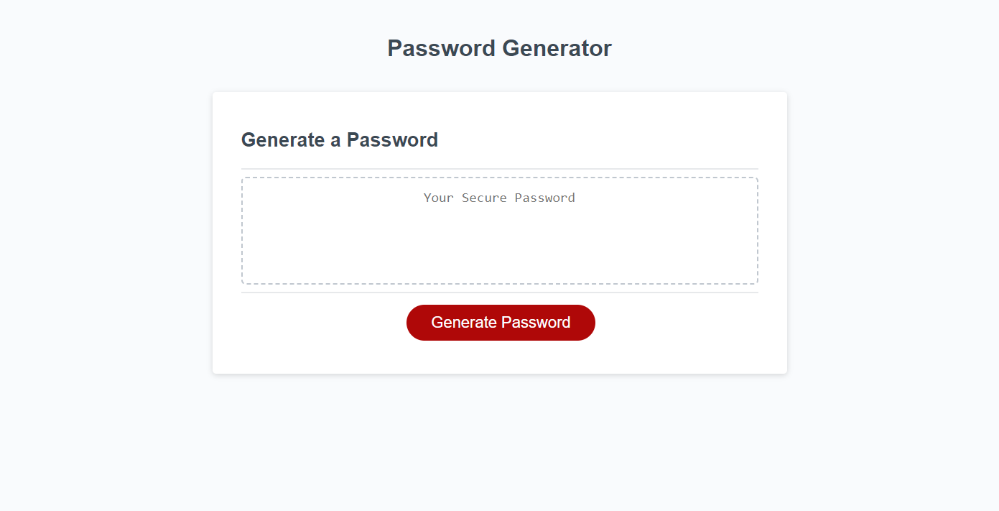
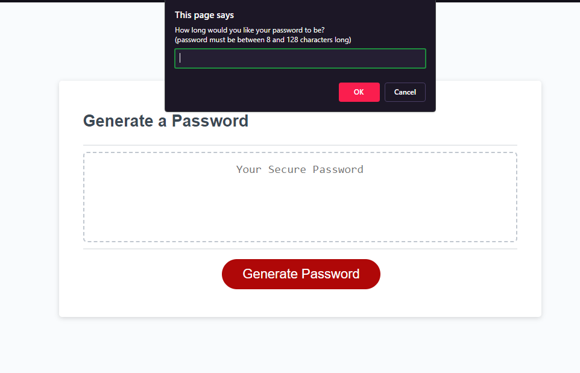
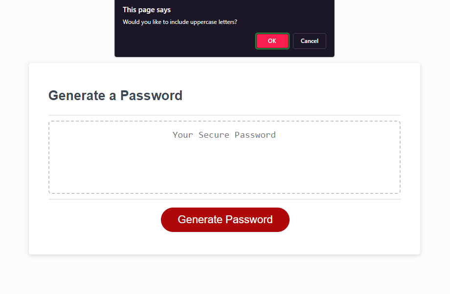
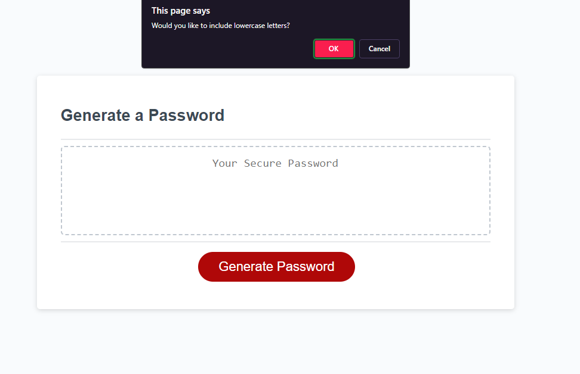
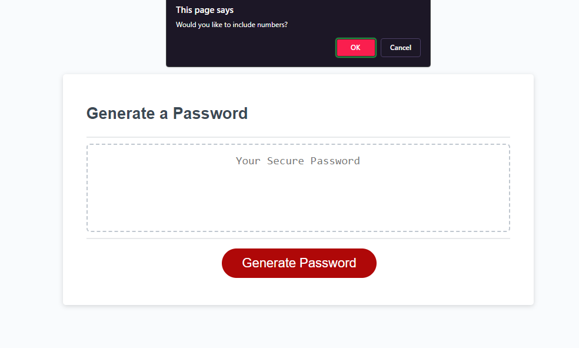
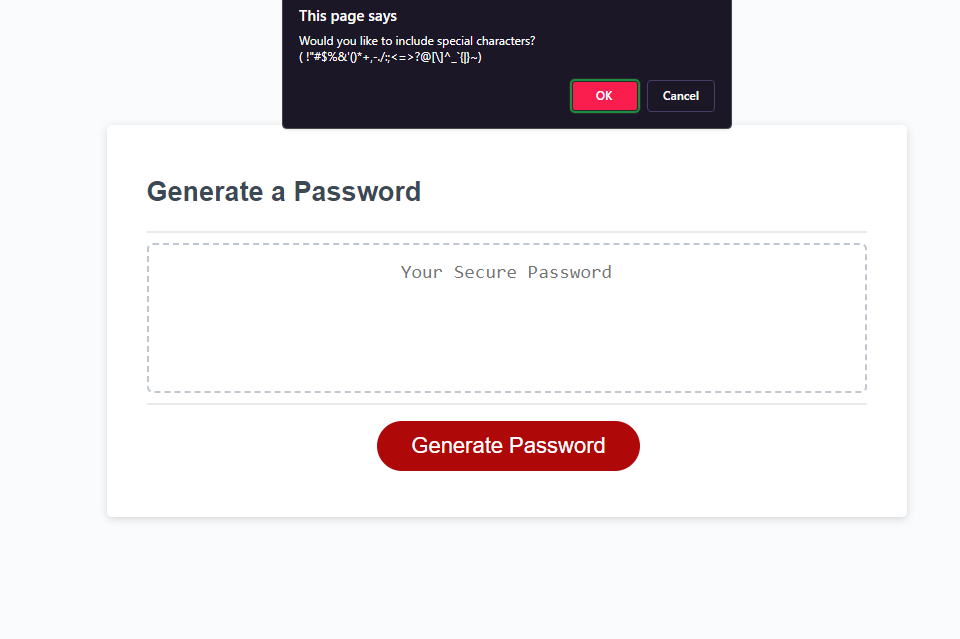
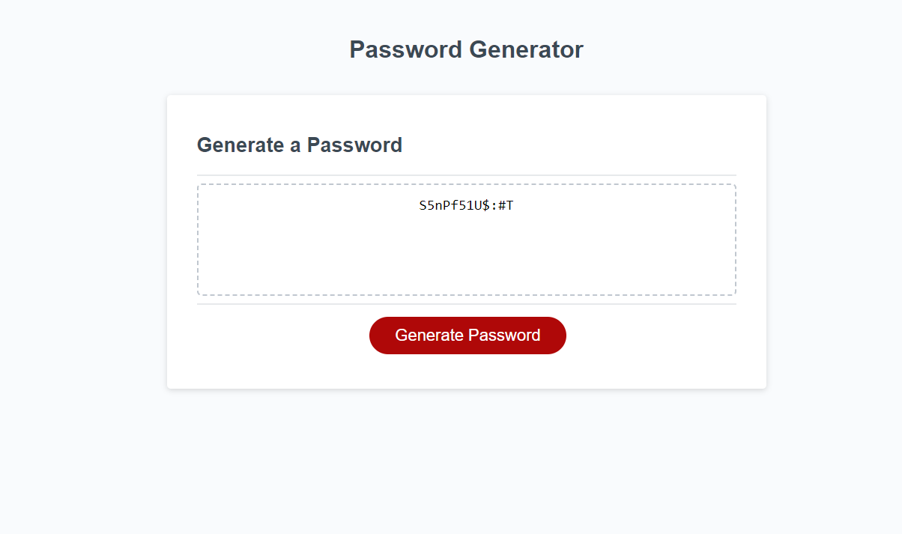

# Strong Password Generator

## Description

This project was part of my bootcamp challenges. The goal was to make a password generator that met specific criteria for a client. On pressing a button the user would be guided through a set of prompts to determine their password parameters. Upon completion they would be presented with the requested password. 

I was excited to tackle this challenge and I tried to do so in an efficient manner. It gave me a chance to learn more about Javascript and to test my ability to go from a simple idea to something responsive and functional. I felt this was a challenging project and actually enjoyed working on it.

## Installation

The working project can be found at:
The respository is located here:

## Usage

To use the generator, click the red generate password button.  

  
  
On the following prompt enter a value between 8 and 128.   

  
  
Then choose from 4 criteria:  
Uppercase letters,  

  
  
Lowercase letters,  

  
   
Numbers,   

  
   
and Special characters.  

  
   
Once this is done the generator will display the created password.   

  
 
## Challenge Requirements

### User Story

```
AS AN employee with access to sensitive data
I WANT to randomly generate a password that meets certain criteria
SO THAT I can create a strong password that provides greater security
```

### Acceptance Criteria

```
GIVEN I need a new, secure password
WHEN I click the button to generate a password
THEN I am presented with a series of prompts for password criteria
WHEN prompted for password criteria
THEN I select which criteria to include in the password
WHEN prompted for the length of the password
THEN I choose a length of at least 8 characters and no more than 128 characters
WHEN asked for character types to include in the password
THEN I confirm whether or not to include lowercase, uppercase, numeric, and/or special characters
WHEN I answer each prompt
THEN my input should be validated and at least one character type should be selected
WHEN all prompts are answered
THEN a password is generated that matches the selected criteria
WHEN the password is generated
THEN the password is either displayed in an alert or written to the page
```


## Contact Information
<strong>Name:</strong> Aaron Allen  
<strong>Email:</strong> aaronseth.allen@gmail.com 